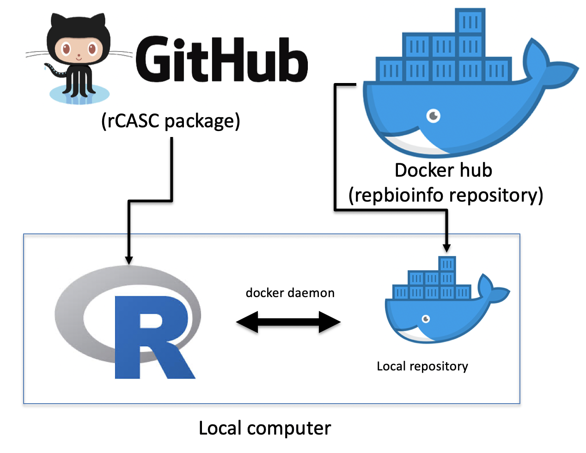
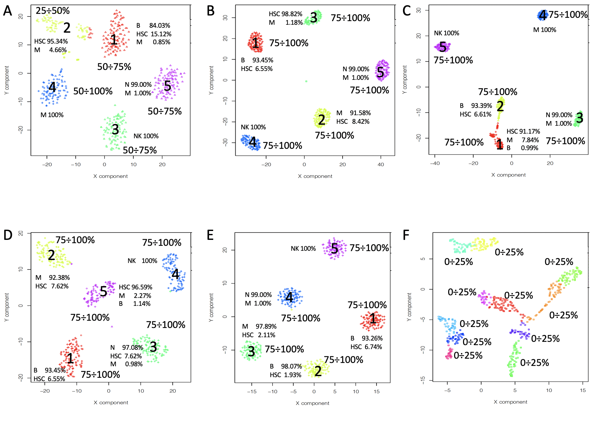
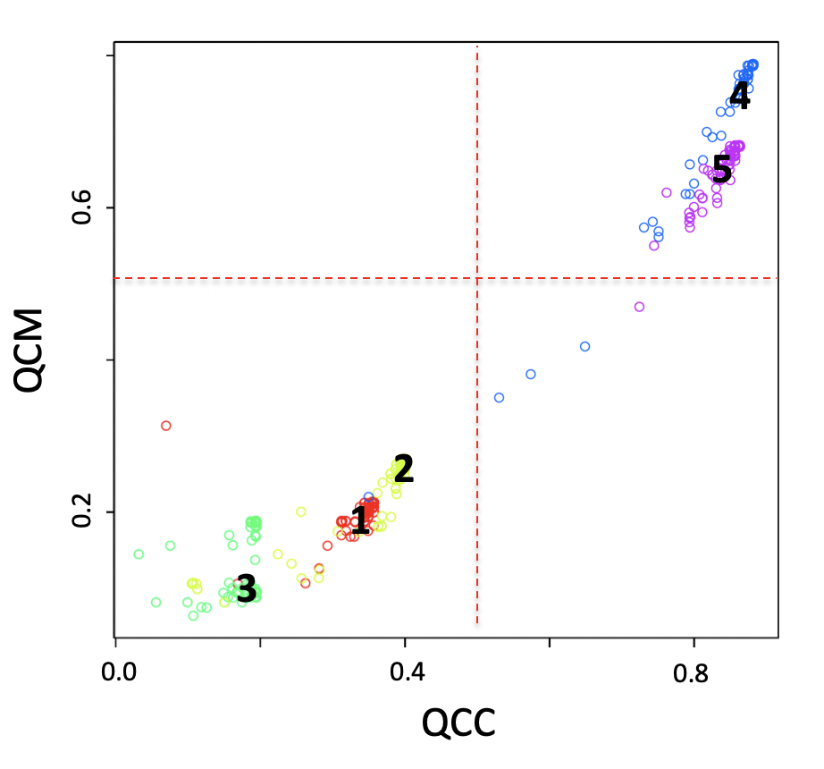
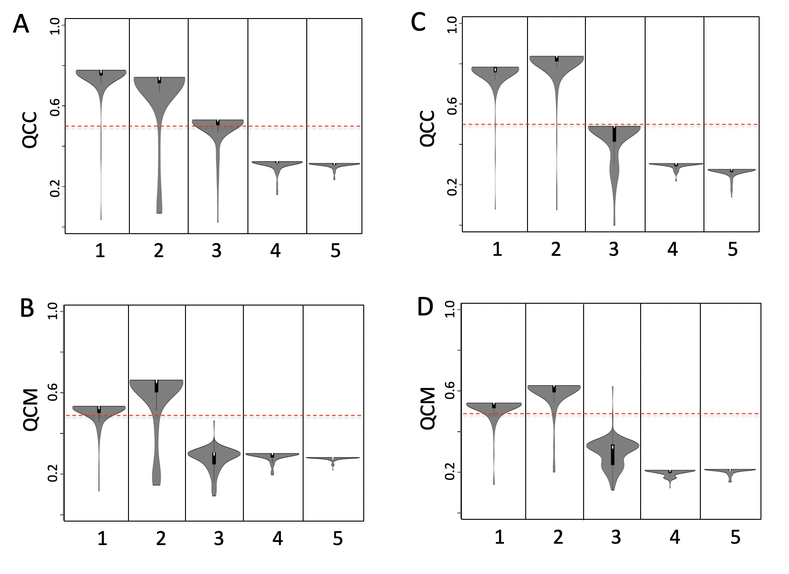
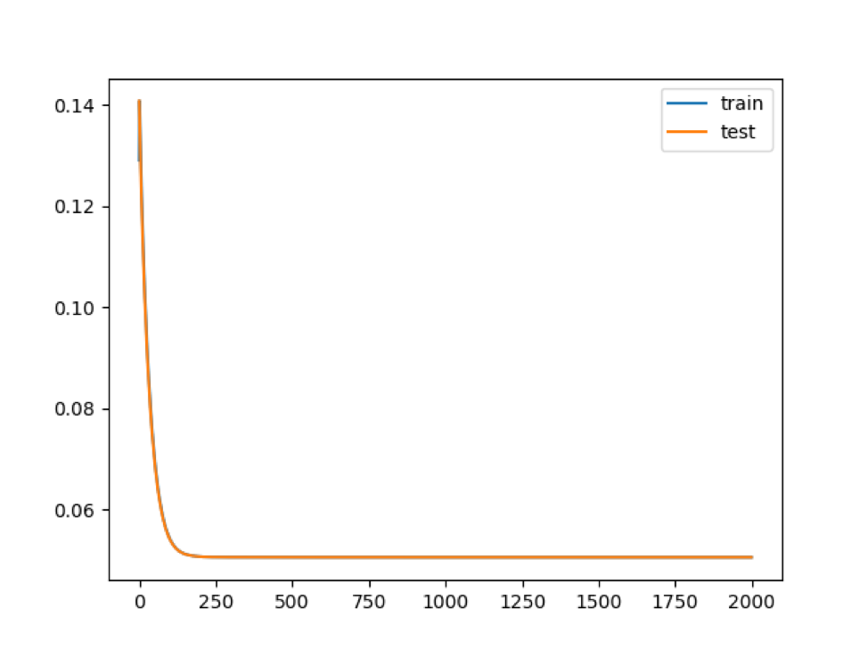
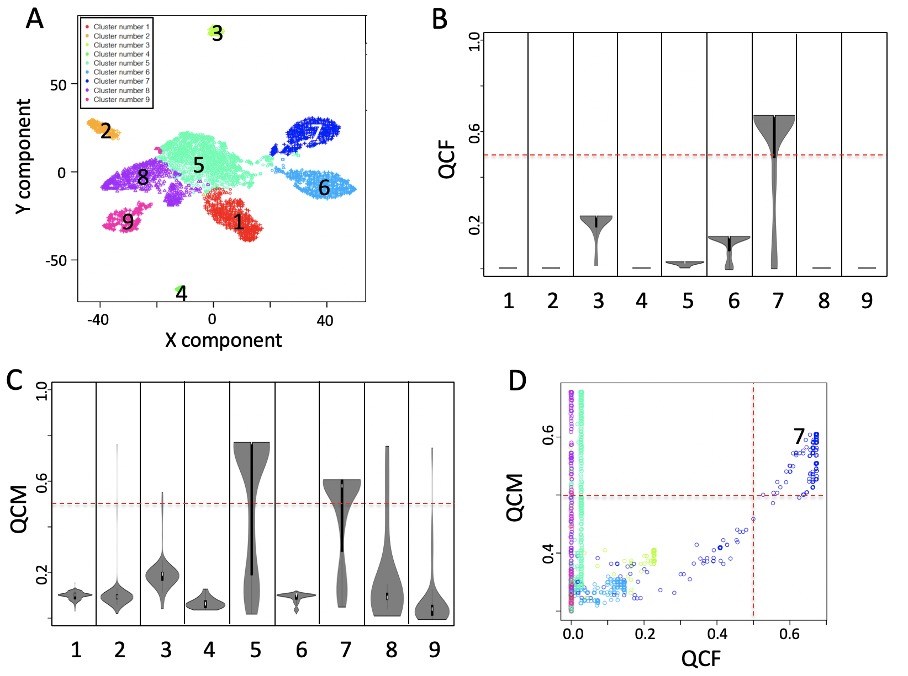

<style>
p.caption {
  font-size: 0.8em;
}
</style>

```{r global_options, include=FALSE}
knitr::opts_chunk$set(fig.pos = 'ht')
#options(warn=-1) # suppress warnings
options(warn=0) # restore warnings
```

# **Section 1**: Brief introduction on Sparsely-Connected-Autoencoder (SCA) analysis

The scRNAseq analysis tools, which are part of the rCASC package [[*Alessandri et al 2019*](https://pubmed.ncbi.nlm.nih.gov/31494672/)], are implemented in docker containers to simplify the installation procedure of the overall workflow and to guarantee functional and computational reproducibility [[*Kulkarni et al. 2018*](https://pubmed.ncbi.nlm.nih.gov/30367595/)]. Figure below shows the overall organization of rCASC.

```{r fig.01, fig.cap="**Figure rCASC organization**. rCASC is available as R package in github repository. rCASC can be installed locally using *install_github* function from devtools R library. A local installation of the docker images required for the analysis can be done with *downloadContainers* function of rCASC package. A local installation of rCASC acts as workflow manage, which interacts with the local docker repository via a specific daemon, to execute scRNAseq data analyses", echo=FALSE, eval=TRUE, out.width="60%", fig.align="center"}
library(knitr)

```


The SCA workflow is shown in the figure below, which describes the basic steps required to extract hidden functional features, i.e.  TFs, miRNAs, Kinases, from a scRNAseq experiment using Sparsely-Connected-Autoencoder. To execute a SCA analysis it is required a scRNAseq count matrix. Subpopulation organization is then discovered using any of the clustering tools implemented in rCASC a), and the quality of the subpopulation organization is evaluated using **C**ell **S**tability **S**core metric b), for more info on CSS please see [[*Alessandri et al 2019 supplementary data*](https://academic.oup.com/gigascience/article/8/9/giz105/5565135#supplementary-data). The clusters'data matrix, which is the count matrix including subpopulation organization, is normalized c). Normalized data are used to train a Sparsely-Connected-Autoencoder d). The hidden layer matrix is saved over multiple runs of the Sparsely-Connected-Autoencoder (hidden layer matrix is made of 0/1 for each hidden node, where 1 indicates that the node was used and 0 that the node was not used). The ability of each hidden layer matrix to reconstruct, at least partially, the expected subpopulation organization is evaluated by clustering e) and the quality of the reconstruction is evaluated using two metrics: **Q**uality **C**ontrol of **C**lusters and **Q**uality **C**ontrol of **M**odels f), more information on these two metrics will be given later in this vignette. The hidden layer frequency matrix provides information of the usage of the hidden nodes (TFs, miRNAs, Kinases) over multiple runs of the Sparsely-Connected-Autoencoder. COMET tool [[*Delaney et al. 2019*](https://pubmed.ncbi.nlm.nih.gov/31657111/)] is then used to grab the most important molecular features, i.e.  TFs, miRNAs, Kinases, associated to each SCA reconstructed cluster.

```{r fig.02, fig.cap="**Figure SCA workflow**.", echo=FALSE, eval=TRUE, out.width="100%", fig.align="center"}
library(knitr)
include_graphics('./img/sca_workflow.png')
```


# **Section 2**: Dataset used in this vignette to demonstrate the use of SCA analysis.

A data set, **setA** [[*Alessandri et al. 2019*](https://academic.oup.com/gigascience/article/8/9/giz105/5565135)], based on FACS purified cell types [[*Zheng et al. 2017*](https://www.nature.com/articles/ncomms14049)] was used to investigate the SCA behaviour.

## **setA: 100 cells randomly selected for each cell type** 

- B-cells (B, 25K reads/cell), 
    
- Monocytes (M, 100K reads/cell), 
    
- Stem cells (HSC, 24.7K reads/cell), 
    
- Natural Killer cells (NK, 29K reads/cell), 
    
- Naive T-cells (N, 19K reads/cell)


SetA was previously used to estimate the strength of CSS metric [[*Alessandri et al. 2019*](https://academic.oup.com/gigascience/article/8/9/giz105/5565135)]. We clustered setA using all the clustering tools actually implemented in rCASC: tSne+k-mean [[*Pezzotti et al. 2017*](Approximated and User Steerable tSNE for Progressive Visual Analytics)], SIMLR [[*Wang et al. 2017*](https://www.nature.com/articles/nmeth.4207)], griph [[*Serra et al. 2019*](https://www.nature.com/articles/s41586-019-1146-y)], Seurat [[*Butler et al. 2018*](https://www.nature.com/articles/nbt.4096)], scanpy [[*Wolf et al. 2018*](https://genomebiology.biomedcentral.com/articles/10.1186/s13059-017-1382-0)] and SHARP [[*Wan et al. 2020*](https://genome.cshlp.org/content/early/2020/01/28/gr.254557.119)]. All tools but tSne+k-mean and scanpy provided very good and similar partition of the different cell types (see Figure below).

```{r fig.03, fig.cap="**Figure SetA clustering**. These results are based on the analysis of a log10 transformed count matrix.", echo=FALSE, eval=TRUE, out.width="100%", fig.align="center"}
library(knitr)

```


# **Section 3**: Manually curated cancer-immune-signature 

A SCA based on manually curated cancer immunosignature detects features specific for clusters 4 and 5 of the setA, see Figure below.

```{r fig.04, fig.cap="**Figure SCA analysis using a manually curated cancer-immune-signature (IS)**. Input counts table for SCA is log10 transformed and 160 permutations were run. Latent space clustering was done with SIMLR.", echo=FALSE, eval=TRUE, out.width="40%", fig.align="center"}
library(knitr)

```


# **Section 4**: variational SCA (vSCA)

Looking at the results at the level of QCC and QCM, vSCA do not provide any advantage with respect to a normal SCA, see Figure below.

```{r fig.05, fig.cap="**Figure vSCA based on TFs targets**. A) QCC TFs based SCA, B) QCM TFs based SCA, C) QCC TFs based vSCA, D) QCM TFs based vSCA . Input counts table for SCA is log10 transformed, analysis was performed using 160 permutations and latent space clustering was done with SIMLR.", echo=FALSE, eval=TRUE, out.width="100%", fig.align="center"}
library(knitr)

```

# **Section 5**: How to run a SCA analysis.

This section provides an example of a SCA analysis, number of permutations is kept very small to reduce computing time. 

**IMPORTANT**: Please note that the results generated in this section are meaningless. They are only used to demonstrate the how SCA functions work. In a real experiment at least 120 permutations **MUST** be execute in each chunk of code, where permutations are indicated.

Computing time, in each chunk, refers the time required to execute the task on a MacBook Pro (3.5 GHz Dual-Core Intel Core i7, 16 Gb RAM).

## **Section 5.1**: autoencoder function

The input data for the **autoencoder** function are generated using the following script. As clustering tool we have used Griph [[*Serra et al. 2019*](https://www.nature.com/articles/s41586-019-1146-y)], Seurat [[*Butler et al. 2018*](https://www.nature.com/articles/nbt.4096)].

```{r, echo=T, eval=T}
start_time <- Sys.time()

library(rCASC)
home <- getwd()
# cat("\n",home,"\n")
dir.create(paste(home, "setA", sep="/"))
dir.create(paste(home, "scratch", sep="/"))
file.copy(from=paste(path.package("rCASC"),"examples/setA.csv.zip", sep="/"), to=paste(home, "setA", sep="/"), overwrite = T)
unzip(paste(home, "setA/setA.csv.zip", sep="/"), exdir=paste(home, "setA", sep="/"))
file.remove(paste(home, "setA/setA.csv.zip", sep="/"))
system(paste("rm -fR ", home,"/setA/__MACOSX", sep=""))  

griphBootstrap(group="docker",scratch.folder=paste(home, "scratch", sep="/"), file=paste(home, "setA/setA.csv", sep="/"),  nPerm=8, permAtTime=8, percent=10, separator=",",logTen=0, seed=111)

end_time <- Sys.time()
cat("\n Computing time: ",end_time - start_time, " mins\n")
```


The autoencoder function feeds the SCA using the data derived by the script shown above.
The chunk below show a single permutation run, which is used to estimate the nEpochs max value. **Figure learning rate** shows an example of the learning curve. In this example the maximum level of learning is obtained with 250 epochs. Thus, the analysis with multiple permutations can be done setting epoch slightly greater than 250, e.g. 300. Learning pictures are saved in **SCAtutorial/vignettes/setA/Results/setATF/5/**

```{r, echo=T, eval=T}
start_time <- Sys.time()

library(rCASC)
home <- getwd()
# cat("\n",home,"\n")
autoencoder(group=c("docker"),
            scratch=paste(home, "scratch", sep="/"),
            file=paste(home, "setA/setA.csv", sep="/"), 
            separator=",", nCluster=5, bias="TF", permutation=1, 
            nEpochs=2000, patiencePercentage=5,
            cl=paste(home, "setA/Results/setA/5/setA_clustering.output.csv", sep="/"), 
            seed=1111, projectName="setATF", bN="NULL")

end_time <- Sys.time()
cat("\n Computing time: ",end_time - start_time, " mins\n")
```

```{r fig.06, fig.cap="**Figure learning rate**.", echo=FALSE, eval=TRUE, out.width="60%", fig.align="center"}
library(knitr)

```


### **Section 5.1.1**: autoencoder parameters (for the full list of parameters please refer to the function help):

    + *group*,	usually set to **docker**, indicating the group of users allowed to execute docker instances.
    
    + *scratch.folder*,	a character string indicating the path of the scratch folder. Usually scratch folder is located on a SSD disk to guarantee optimal IO.
    
    + *file*,	a character string indicating the path of the count matrix, it includes count matrix name with extension.

    + *bias*, 6 options are available: "mirna" , "TF", "CUSTOM", "kinasi","immunoSignature", "ALL". This parameter refers to the rules used to generate the partially connected hidden layer. If ALL is used, mirna, TF, kinasi, immunoSignature are combined to generate a SSCA (Sparse-Sparsely-Connected-Autoencoder). If CUSTOM is selected the path to the file required to build the autoencoder structure should be assigned to the parameter bN. The hidden layer description file must have the following structure source (header is mandatory and row names must not be present, any extra column will be not taken in account):

        + name of the hidden layer node, column 1 
            
        + geneTarget, i.e. genes present in the hidden node, column 2. 

    + *nEpochs*, this is the parameter referring to the number of times the training vectors are used to update the hidden layers weights. At the end of this learning step the best weights for nodes are defined. Please note that the best weights are not necessarily in the last epoch. Frequently, they are located in the first 1000 epochs. Thus, a good approach is to run 2000 epochs with 1 permutation only and check the learning rate, see figure below. The optimal epochs is selected within the flat part of the learning curve. Then, the analysis is run again with the number of permutations of your choice. 

    + *permutation*, this parameter refers to the  number of times the neural network is calculated from scratch. The number of permutations depends on the level of consistency requested, usually 160 permutations provides robust results, but it might take some times to execute on a common laptop. 

    + *cl*, this parameter refers to the full path to the **\_clustering.output** file to be used, which was generated using rCASC clustering, see the output of the above chunk of code.

    + *ProjectName* parameter refers to the name of the folder where **autoencoder** outputs will be saved. 


```{r, echo=T, eval=T}
start_time <- Sys.time()

library(rCASC)
home <- getwd()
# cat("\n",home,"\n")
autoencoder(group=c("docker"),
            scratch=paste(home, "scratch", sep="/"),
            file=paste(home, "setA/setA.csv", sep="/"), 
            separator=",", nCluster=5, bias="TF", permutation=8, 
            nEpochs=300, patiencePercentage=5,
            cl=paste(home, "setA/Results/setA/5/setA_clustering.output.csv", sep="/"), 
            seed=1111, projectName="setATF", bN="NULL")

end_time <- Sys.time()
cat("\n Computing time: ",end_time - start_time, " mins\n")
```

The **autoencoder** function produces as output many files with the extension **Ndensespace.format**, in the folder **Results/ProjectName/Permutation**. The number of such files corresponds to the number of selected permutations. In this specific examples autoencoder outputs are in **/SCAtutorial/vignettes/setA/Results/setATF/5/permutation/** folder.

## **Section 5.2**: autoencoderClustering function

The function **autoencoderClustering** generates the numerical data required to understand if there is coherence between counts table derived clusters and those derived using autoencoders latent space. 


```{r, echo=T, eval=T}
start_time <- Sys.time()

home <- getwd()
# cat("\n",home,"\n")
library(rCASC)
autoencoderClustering(group="docker", scratch.folder=paste(home, "scratch", sep="/"),
                      file=paste(home, "setA/Results/setATF/setA.csv", sep="/"),
                      separator=",", nCluster=5, clusterMethod="GRIPH", seed=1111, 
                      projectName="setATF", permAtTime=8)

end_time <- Sys.time()
cat("\n Computing time: ",end_time - start_time, "\n")
```
### **Section 5.2.1**: autoencoderClustering parameters (for the full list of parameters please refer to the function help):

    + **IMPORTANT**: *file* parameter refers to the full path of the count table copied in the results output folder of the **autoencoder** function. See as example the above chunk of code

    + *projectName* parameter is the same indicated in **autoencoder** function. 

    + *clusterMethod* parameter refers to any of the clustering methods available in rCASC ("GRIPH","SIMLR","SEURAT","SHARP"), not necessary should be the same used for the raw count table clustering, actually it is useful to test more than one clustering method to see which one provides the best convergence with the clusters initially generated using the genes counts table. 

    + *pcaDimensions* parameter is only required when Seurat is used as clustering tool.
    
The **autoencoderClustering** output is a folder where the name is given by the combination of the *projectName* and the  *clusterMethod*, e.g in the above example **/Results/setATF_GRIPH**. In the example above, in the folder **/SCAtutorial/vignettes/setA/Results/setATF_GRIPH/5/**, there is the file **label.csv**, where is located the cluster assignment for each cells over each permutation.


## **Section 5.3**: autoencoderAnalysis function

The output of **autoencoderClustering** is used by the function **autoencoderAnalysis** to generate the QCC and QCM statistics. QCC is an extension of CSS, for a complete mathematical description of CSS please see [[*Section 5.1 Cell Stability Score: mathematical description in Alessandri et al. 2019 supplementary data*](https://oup.silverchair-cdn.com/oup/backfile/Content_public/Journal/gigascience/8/9/10.1093_gigascience_giz105/3/giz105_supplemental_file.pdf?Expires=1601298947&Signature=AIwO6972mkxBsv21FqHZswitIhHqb4a~f2dodtwjVPvXJdNXrSWp1VPJHOgjxN7ZOLg-DKBR4uMWPTNfXB1IsFNFLeFyEeulIwJpscXny0gfDZw2Psl~PL-CJ9s~B7pcHZdEkuL8NeCbGrwZsJbZ~C5gvThT4gBQmogBnzGhYfMxFuavVULAGxOuJqZkvFpp8DIf87mOu5hCKWXLF6bjehduqFXIcETxR9PeRzM6X~oykQsUvFR-QSurcRq4yJWHtuEwxaRcjI1wu9DRyoF14FxZheiUb1bxOHdX388kaf~eg8JgnsMQLy2CgahgC5dUKBFl8MBWZPliY01o8yyL~w__&Key-Pair-Id=APKAIE5G5CRDK6RD3PGA)] and it measures the ability of latent space to keep aggregated cells belonging to predefined clusters generated using the gene count table. The metrics has the range between 0 and 1, where 1 indicates a high coexistence of cells within the same cluster in the analysis, and 0 a total lack of coexistence of cells within the same cluster. 

```{r, echo=T, eval=T}
start_time <- Sys.time()

home <- getwd()
cat("\n",home,"\n")
library(rCASC)
autoencoderAnalysis(group="docker", scratch.folder=paste(home, "scratch", sep="/"),
                    file=paste(home, "setA/Results/setATF/setA.csv", sep="/"), 
                    separator=",", nCluster=5, seed=1111, 
                    projectName="setATF_GRIPH", Sp=0.8)

end_time <- Sys.time()
cat("\n Computing time: ",end_time - start_time, "\n")
```


In the figure below, only cluster 7 can be well explained by latent space, Figure below panel B. 
QCM metric is also an extension of CSS and it measures the ability of the neural network to generate consistent data over the different training. In the Figure below panel C, SCA provides consistent data only for clusters 5 and 7.  Informative clusters are those characterized by high QCM and QCC scores. In Figure below panel D, only cluster 7 is characterized by a robust neural network able to keep the cell aggregated using hidden layer knowledge. Dashed red line (Figure below panel D) indicates the defined threshold to consider the latent space information suitable to support cells’ clusters. 

```{r fig.07, fig.cap="**Figure QCC and QCM**. Summary generated using output of autoencoderAnalysis for the Breast cancer data set in Fig. 5 main manuscript. A) Nine clusters were detected analysing breast cancer dataset with SIMLR. B) QCC violin plot. C) QCM violin plot, D) Combined view of QCM and QCC", echo=FALSE, eval=TRUE, out.width="100%", fig.align="center"}
library(knitr)

```

### **Section 5.3.1**: autoencoderAnalysis parameters (for the full list of parameters please refer to the function help):

        + **IMPORTANT**: *file* parameter refers to the full path of the count table copied in the results output folder of the **autoencoder** function. See as example the above chunk of code (same as for autoencoderClustering function)

    + *projectName* parameter is the same indicated in **autoencoder** function. 
    
    + *sp* is the similarity threshold defined for CSS. This paramenter has as default 0.8. Reduction below 0.7 of this threshold reduces the specificity of CSS; values equal or smaller than 0.5 are meaningless.
    
The outputs of **autoencoderAnalysis** are the pdfs:

- **_stabilityPlot.pdf** (QCC, Figure panel B)

- **_stabilityPlotUNBIAS.pdf** (QCM, Figure panel C)

- **_StabilitySignificativityJittered.pdf** (QCM versus QCC, Figure panel D)

The above files are saved in **setA/Results/setATF/5/**


## **Section 5.4**: autoFeature function

The **autoFeature** creates the frequency table for COMET analysis [[*Delaney et al. 2019*](https://pubmed.ncbi.nlm.nih.gov/31657111/)].

```{r, echo=T, eval=T}
start_time <- Sys.time()

home <- getwd()
cat("\n",home,"\n")
library(rCASC)
autoFeature(group="docker", scratch.folder=paste(home, "scratch", sep="/"), 
            file=paste(home, "setA/Results/setATF/setA.csv", sep="/"),
            separator=",", nCluster=5, projectName="setATF_GRIPH")

end_time <- Sys.time()
cat("\n Computing time: ",end_time - start_time, "\n")
```


### **Section 5.4.1**: autoFeature parameters (for the full list of parameters please refer to the function help):

        + **IMPORTANT**: *file* parameter refers to the full path of the count table copied in the results output folder of the **autoencoder** function. See as example the above chunk of code (same as for autoencoderClustering function)

    + file e projectName parameters refer to the outputs of **autoencoderAnalysis** 


## **Section 5.5**: comet2 function

**cometsc2** is a modification of **cometsc** function, used in rCASC to extract cluster specific genes, suitable to handle **autoencoder** frequency table, i.e. **autoencoder** frequency table contains the % of permutations in which each hidden node for each cell was characterized by a weight different from 0 (if a hidden node is characterized by a weight equal to 0 it means that it was not used in that specific permutation). 


```{r, echo=T, eval=T}
start_time <- Sys.time()

home <- getwd()
cat("\n",home,"\n")
library(rCASC)
cometsc2(group="docker", file=paste(home, "setA/Results/setATF_GRIPH/5/freqMatrix.csv", sep="/"),
         scratch.folder=paste(home, "scratch", sep="/"), threads=2, X=0.15, K=2, counts="False", 
         skipvis="False", nCluster=5, separator=",",
         clustering.output=paste(home,"setA/Results/setA/5/setA_clustering.output.csv",sep=""))

end_time <- Sys.time()
cat("\n Computing time: ",end_time - start_time, "\n")
```


**cometsc2** outputs are the same of COMET, for more information please refer to [*COMET documentation*](https://hgmd.readthedocs.io/en/latest/).

**IMPORTANT**: This function produces an output including all clusters, but **only results related to clusters supported by QCM and QCC means greater than 0.5 have to be taken in account**.

### **Section 5.5.1**: autoFeature parameters (for the full list of parameters please refer to the function help):

    + *file* is the path to the frequency matrix generated by **autoFeature** function. 
    
    + *clustering.output* is the path to the clustering.output generated by rCASC on the initial counts table 
    
    + *counts*,	if set to True it will calculate log10(expression+1). To be used if unlogged data are provided
    
    + *nCluster*,	number of interested cluster used for analysis
    
    + *skipvis*,	set to True to skip visualizations
    
    + *X*,	values from 0 to 1 argument for XL-mHG default 0.15, for more info see cometsc help.
    
    + *K*,	the number of gene combinations to be considered., possible values 2, 3, 4, default 2. WARNING increasing the number of combinations makes the matrices very big
    
## **Section 5.6**: wrapperAutoencoder function

The function **wrapperAutoencoder** executes all the steps required for the autoencoder analysis. It should be used when it is clear the overall set of steps to be performed and the parameters to be used.

```{r, echo=T, eval=F}
start_time <- Sys.time()

home <- getwd()
cat("\n",home,"\n")
library(rCASC)
wrapperAutoencoder(group="docker", scratch.folder=paste(home, "scratch", sep="/"),  
                   file=paste(home, "setA/setA.csv", sep="/"), separator=",",
                   nCluster=5, bias="TF", permutation=8, nEpochs=300, 
                   cl=paste(home,"setA/Results/setA/5/setA_clustering.output.csv",sep=""),
                   projectName="setATF",clusterMethod="GRIPH")
```

- *wrapperAutoencoder parameters*:

    + *group*,	a character string. Two options: sudo or docker, depending to which group the user belongs

    + *scratch.folder*,	a character string indicating the path of the scratch folder

    + *file*,	a character string indicating the path of the file, with file name and extension included

    + *separator*,	separator used in count file, e.g. '\t', ','

    + *nCluster*,	number of cluster in which the dataset is divided

    + *bias*,	bias method to use : "mirna" , "TF", "CUSTOM", kinasi,immunoSignature

    + *permutation*,	number of permutations to perform the pValue to evaluate clustering

    + *nEpochs*,	number of Epochs for neural network training

    + *patiencePercentage*,	number of Epochs percentage of not training before to stop.

    + *cl*,	Clustering.output file. Can be the output of every clustering algorithm from rCASC or can be customized with first column cells names, second column cluster they belong.All path needs to be provided.

    + *seed*,	important value to reproduce the same results with same input

    + *projectName*,	might be different from the matrixname in order to perform different analysis on the same dataset

    + *bN*,	name of the custom bias file. This file need header, in the first column has to be the source and in the second column the gene symbol.All path needs to be provided,

    + *lr*,	learning rate, the speed of learning. Higher value may increase the speed of convergence but may also be not very precise

    + *beta_1*,	look at keras optimizer parameters

    + *beta_2*,	look at keras optimizer parameters

    + *epsilon*,	look at keras optimizer parameters

    + *decay*,	look at keras optimizer parameters

    + *loss*,	loss of function to use, for other loss of function check the keras loss of functions.

    + *clusterMethod*,	clustering methods: "GRIPH","SIMLR","SEURAT","SHARP"

    + *pcaDimensions*,	number of dimensions to use for Seurat Pca reduction.

    + *permAtTime*,	number of permutation in parallel

    + *largeScale*,	boolean for SIMLR analysis, TRUE if rows are less then columns or if the computational time are huge

    + *Sp*,	minimun number of percentage of cells that has to be in common between two permutation to be the same cluster.

    + *threads*,	integer refering to the max number of process run in parallel default 1 max the number of clusters under analysis, i.e. nCluster

    + *X*,	from 0 to 1 argument for XL-mHG default 0.15, for more info see cometsc help.

    + *K*,	the number of gene combinations to be considered., possible values 2, 3, 4, default 2. WARNING increasing the number of combinations makes the matrices very big

    + *counts*,	if set to True it will graph the log(expression+1). To be used if unlogged data are provided

    + *skipvis*,	set to True to skip visualizations


